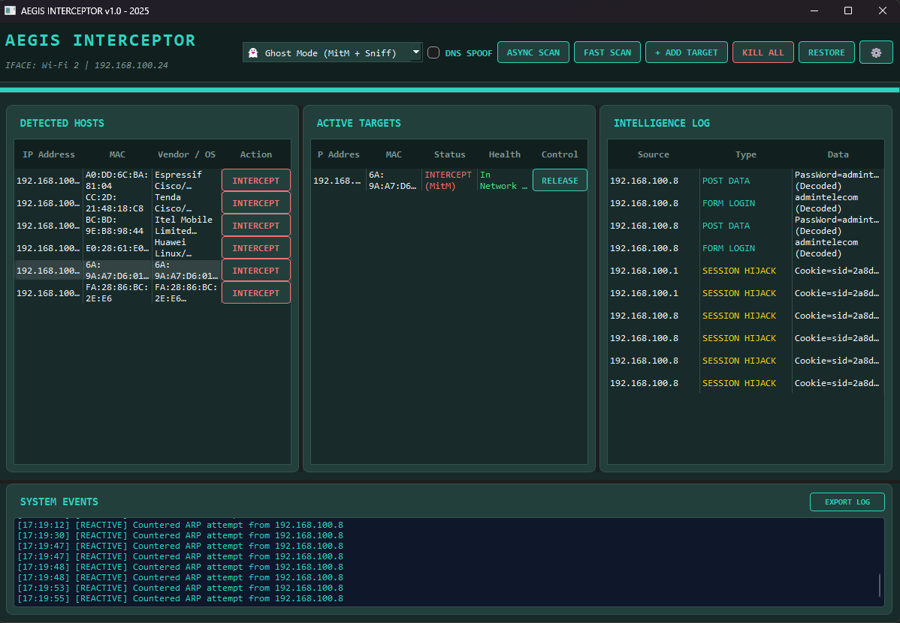

# AEGIS INTERCEPTOR

**Local Network Interception & Testing Tool**

<div align="center">
  
  <br><br>
  
  [](https://opensource.org/licenses/MIT)
  [](https://www.python.org/)
  []()
  []()
</div>

> **FOR AUTHORIZED SECURITY TESTING AND EDUCATIONAL PURPOSES ONLY**

This tool demonstrates ARP spoofing, DNS spoofing, packet sniffing, and network interruption techniques in a controlled lab environment.

### ⚠️ Legal Warning
- Use **only** on networks you own or have **explicit written permission** to test.
- Unauthorized use may violate laws such as the Computer Fraud and Abuse Act (US), Computer Misuse Act (UK), or equivalent in your country.
- The author is **not responsible** for any misuse.

### Key Features
A user agreement is enforced on first launch.
*    Zero-Copy Engine (ZCE)
  The core of AEGIS is its custom Zero-Copy Engine, designed for high-throughput analysis with minimal CPU overhead. By leveraging raw socket optimizations and Scapy-integrated fallback buffers, the ZCE ensures that the act of observation does not introduce significant latency or an "observer effect" into the network environment.

*    DNS Distortion & Resolution Analysis
  The DNS Distortion module serves as a laboratory for testing DNS resilience. It allows researchers to simulate resolution anomalies, such as redirection or record spoofing, within a controlled environment. This feature is essential for hardening enterprise infrastructure against modern "Man-in-the-Middle" (MitM) vectors.

*    Passive Intelligence & Endpoint Fingerprinting
  Operating in a non-intrusive "Stealth Mode," AEGIS aggregates metadata without generating active probes. By analyzing Time-to-Live (TTL) values and payload signatures, the module identifies "shadow IT" devices and unauthorized hardware that may represent a weak link in the network security chain.

*    Security Circuit Breaker (Protocol Slayer)
  The Security Circuit Breaker is a high-speed parsing engine that validates network flows against RFC standards. It identifies malformed headers or protocol smuggling attempts and allows researchers to terminate non-compliant or suspicious sessions instantly during a security audit.

### Other Features
*    Raw Socket Injection: Bypasses standard OS latency for high-performance packet manipulation.
*    Ghost Mode (MitM): Intercepts traffic transparently without disrupting target connectivity.
*    Async Scan Engine: Sweeps subnets 10x faster than standard serial scanners using `asyncio`.
*    Gateway Safe Mode: Prevents accidental router DoS during audits.
*    Passive Fingerprinting: Identifies OS types (Windows/Linux/iOS) via TTL analysis.

### Requirements
- Python 3.8+
- Root/Administrator privileges
- Npcap (Windows) or libpcap (Linux)
- Packages: see `requirements.txt`

### Installation
```bash
# 1. Clone the repository
git clone https://github.com/MehtabGul/Aegis-Interceptor.git
cd Aegis-Interceptor
